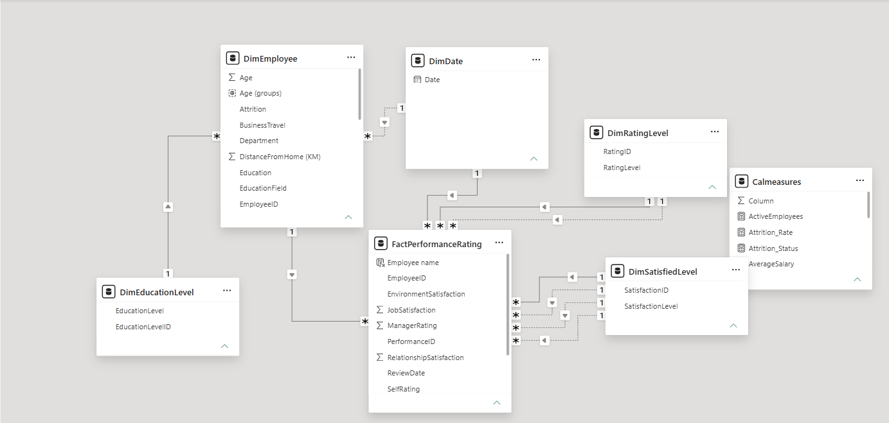
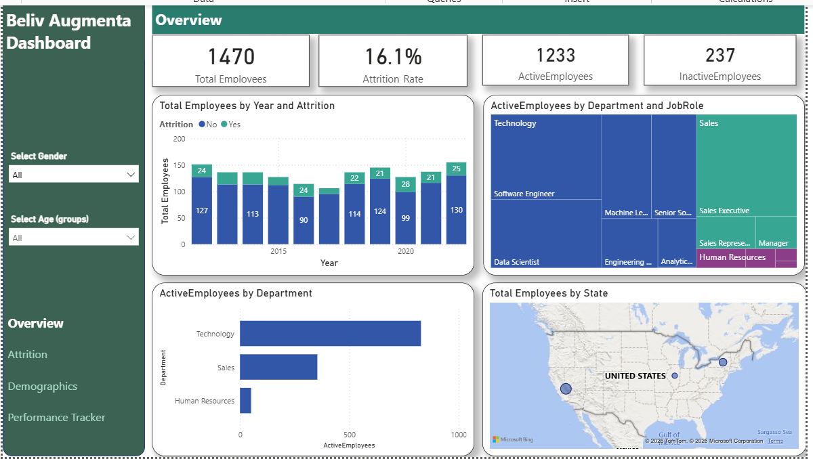
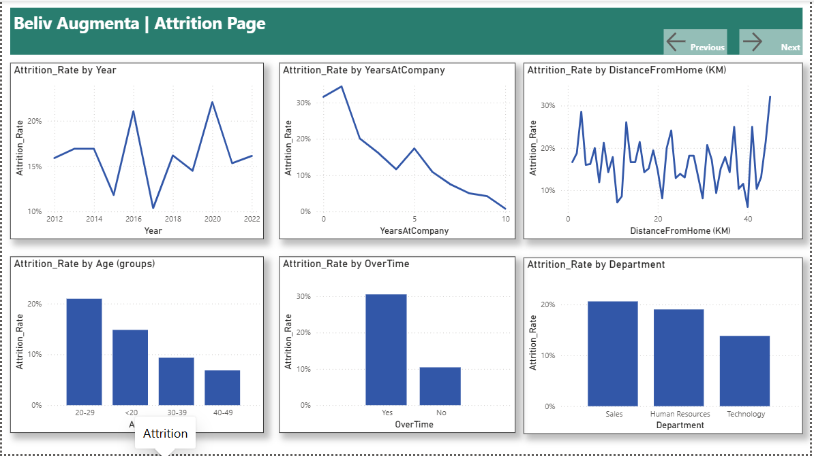
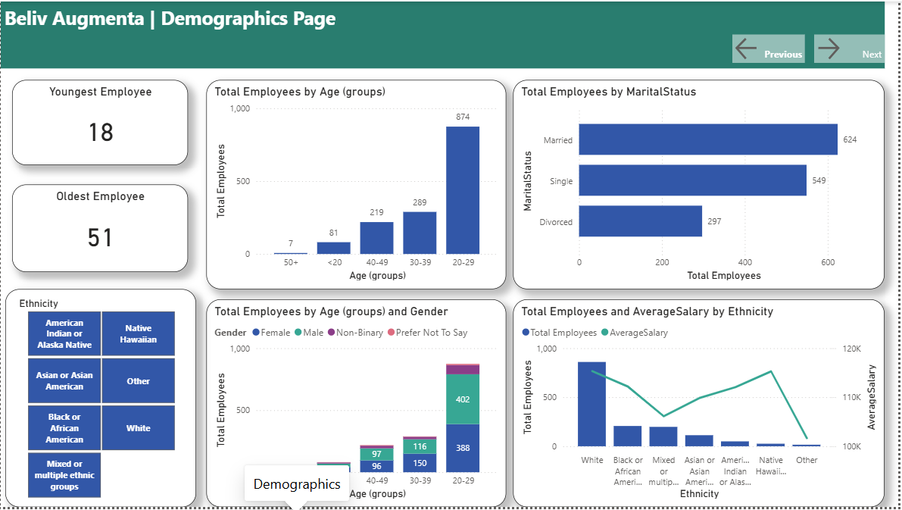

# 📊 Beliv-Augmenta Employee Attrition & Performance Analysis

## 📌 Project Overview
Employee attrition—the loss of staff due to resignation or retirement—creates heavy organizational costs and drains institutional knowledge. As a Data Analyst at **Beliv-Augmenta**, this project focuses on identifying core drivers behind employee turnover. By transforming messy workforce data into actionable insights, this Power BI interactive dashboard helps HR leaders shift from **reactive hiring** to **proactive retention strategies**.

---

## 🏗️ Data Architecture & Star Schema
The project relies on an optimized **Star Schema** to ensure clean filtering and high DAX performance. It is split into **4 Dimension Tables** and **1 Central Fact Table**:

*   **`FactPerformanceRating`**: Holds historical performance records, timeline logs (`ReviewDate`), manager ratings, self-evaluations, and workplace tracking metrics.
*   **`DimEmployee`**: Contains demographic details (Age, Gender, Marital Status, Ethnicity), department structures, and office variables (Distance from home, Overtime status).
*   **`DimDate`**: The master calendar dimension enabling clean time-intelligence trends across fiscal years.
*   **`DimRatingLevel` & `DimSatisfiedLevel`**: Standardized lookups that map numerical survey scores to clear descriptive tiers.
*   **`Calmeasures`**: A dedicated folder keeping key KPI calculations organized and separate from physical rows.

### 🔗 Relationships & Modeling
*   `DimEmployee` connects to `FactPerformanceRating` on `EmployeeID` (1 to * Relationship).
*   `DimDate` connects to `FactPerformanceRating` on `Date` to `ReviewDate` (1 to * Relationship).
*   `DimEducationLevel`, `DimRatingLevel`, and `DimSatisfiedLevel` serve as lookup tables to unpack fact and dimension keys.

---

## 📊 Dashboard Insights Breakdown

### 1. Executive Summary (Overview)
*   **Baseline Workforce**: The company currently monitors **1,470 total employees**, maintaining an active headcount of **1,233** alongside **237 historic exits**.
*   **The Problem Metric**: The company-wide **Attrition Rate sits at 16.1%**. 
*   **Department Concentration**: **Technology** accounts for the massive majority of active headcount, followed by Sales and a minimal Human Resources footprint.

### 2. Deep Dive: Key Attrition Drivers
*   **The Overtime Trap**: Employees clocking **Overtime** exhibit a striking **~30% attrition rate**, compared to just ~10% for standard hour workers. This flags immediate burnout risks.
*   **Tenure & Experience**: Turnover heavily spikes during an employee's **very first year (over 30%)** and stabilizes downward past year 5. Onboarding and early-career support need attention.
*   **Age Demographics**: Younger professionals aged **20-29** experience the highest attrition (~21%).
*   **Departmental Breakdown**: **Sales** leads organizational departures at over 20%, slightly edging past HR.
*   **Commute Distance**: A clear correlation shows that long-distance commutes (>35 KM) introduce massive volatility and a higher likelihood of resignation.

### 3. Workplace Demographics
*   **Age Clusters**: The workforce is heavily concentrated in the **20-29 age category** (874 employees).
*   **Marital Status**: Married professionals represent the largest group (624), followed closely by single employees (549).
*   **Compensation Equity**: Pay structure averages out reasonably stable around the \$100k–\$115k band across primary ethnic groups, mitigating major compensation anomalies.

---

## 🛠️ Tech Stack & Skills Highlighted
*   **Tool**: Microsoft Power BI Desktop
*   **Modeling**: Star Schema, Relationships (1-to-Many), Cross-filtering directions.
*   **DAX Operations**: Custom Explicit Measures for `Attrition Rate`, `Active Employees`, and `Inactive Employees`.

---

## 🚀 Actionable HR Recommendations
Based on the dashboard insights, Beliv-Augmenta should prioritize these 3 actions:
1.  **Overtime Cap & Audit**: Investigate teams where Overtime is exceeding normal limits. Redraw resource plans to prevent extreme burnout.
2.  **First-Year Mentorships**: Build a dedicated 90-day onboarding and check-in system specifically targeting the high "Year 0 to 1" flight risk.
3.  **Flexible/Remote Commute Policies**: Implement hybrid schedules or transportation stipends for employees traveling long distances to lower commute stress.

## Files Included

- `Final Work.pbix`:[Power BI dashboard file.](Docs/Final%20Work.pbix).

---

*Thanks for checking out my financial analyst project! Feel free to connect or drop any suggestions on my layout!*
*please contact Sadat Ibrahim at [sadatibrahim236@gmail.com](mailto:sadatibrahim236@gmail.com)*

