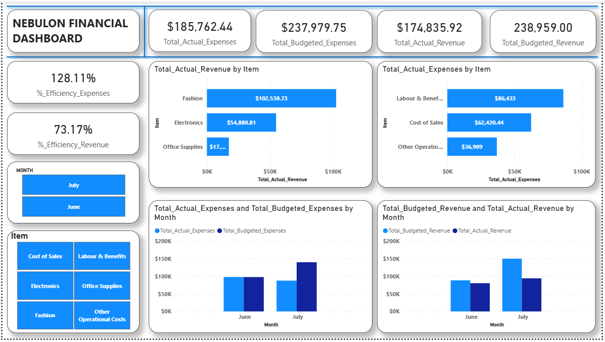

# Nebulon Financial Performance Dashboard (Actual vs. Budget)

## ❓ The Business Problem
Nebulon's raw financial data was structured in a way that made it incredibly difficult to build pivot tables, standard charts, or write clean DAX measures. The budget numbers and actual outcomes were tangled up together. 

---

## 🛠️ Data Transformation & DAX Modeling
To make the data usable for reporting, I unpivoted and cleaned the data in Power Query, `clean_nebulon_data.m` [here](power%20query/clean_nebulon_data.m).
Then, to create a clean reporting table that separates actual amounts from budget amounts by item and month, `CalMeasures.dax` [here](dax-measures/CalMeasures.dax).

---

## 📊 High-Level Key Metrics (KPIs)
After transforming the data, I pulled the baseline financial totals into the dashboard cards:

*   **Total Actual Expenses:** $185,762.44
*   **Total Budgeted Expenses:** $237,979.75
*   **Total Actual Revenue:** $174,835.92
*   **Total Budgeted Revenue:** $238,959.00
*   **Expense Efficiency:** **128.11%** (We spent *more* actual operational dollars relative to the specific baseline targets than expected)
*   **Revenue Efficiency:** **73.17%** (We fell short of meeting our budgeted revenue goals)

---

## 🔍 Major Dashboard Insights

### 1. Revenue Breakdown (Where the money came from)
*   **Top Earner:** **Fashion** brought in the most actual revenue by far at **$102,530.73**.
*   **Runner Up:** **Electronics** brought in **$54,880.81**.
*   **Lowest Earner:** **Office Supplies** brought in just **$17K**.
*   **The Problem:** Every single revenue category missed its budget target. **Electronics** suffered the worst variance, missing its goal by **-$29,334.27**, followed closely by **Fashion** at **-$28,012.19**.
 

### 2. Expense Breakdown (Where the money went)
*   **Biggest Cost:** **Labour & Benefits** was our highest operational expense at **$86,433**.
*   **Cost of Sales:** This came in second at **$62,420.44**.
*   **Other Operational Costs:** This was the lowest at **$36,909**.
*   **The Variance:** On the bright side, actual expenses were actually lower than what was budgeted across the board. We saw the biggest positive savings in **Labour & Benefits**, coming in **-$27,309.75** under budget.

### 3. Month-over-Month Trends (June vs. July)
*   In **June**, actual expenses were higher than actual revenues.
*   In **July**, the situation inverted nicely: actual revenues jumped up and outperformed actual expenses, showing a positive directional trend moving into the end of summer.

---

## 💡 Quick Analyst Recommendations
1. **Fix Revenue Forecasting:** Since we missed our revenue goals by over 26% (73.17% efficiency), our sales targets for *Fashion* and *Electronics* might be set unrealistically high. We should adjust next quarter's expectations.
2. **Investigate July's Success:** July saw a major revenue spike compared to June. We should find out what marketing or sales push happened in July and replicate it.
3. **Keep Labor Costs Controlled:** The team did a great job keeping *Labour & Benefits* under budget. We should continue this spending discipline without burning out the staff.

---

## Open complete dashboard  
Open the `dashboard.png` using Power BI Desktop.

You can also view a PDF of the dashboard , `NebulonFinancialData (Power BI).pdf`. [here](NebulonFinancialData%20(Power%20BI).pdf).

---

## Files Included
- `NebulonFinancialData (worked).pbix`:[Power BI dashboard file.](data/NebulonFinancialData%20(worked).pbix).

- `NebulonFinancialData.xlsx`: [Raw excel data from institution.](data/NebulonFinancialData.xlsx).
- `README.md`: Project documentation.

---

*Thanks for checking out my financial analyst project! Feel free to connect or drop any suggestions on my layout!*
*please contact Sadat Ibrahim at [sadatibrahim236@gmail.com](mailto:sadatibrahim236@gmail.com)*
